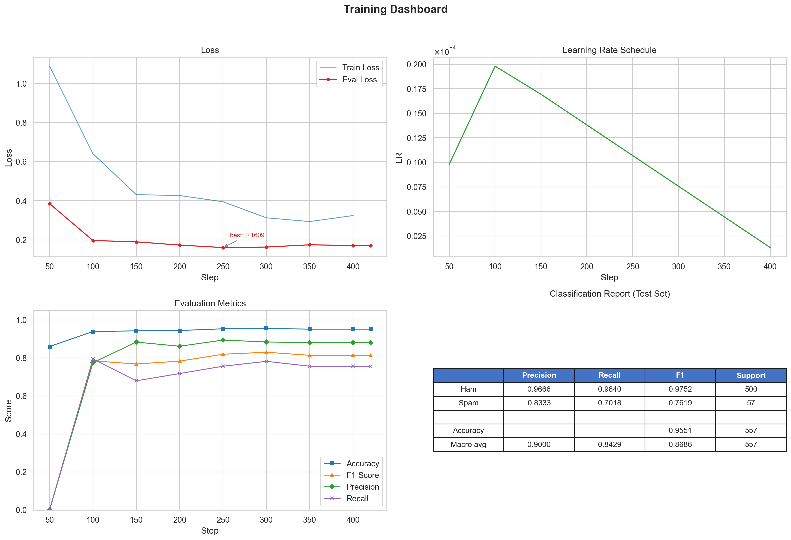
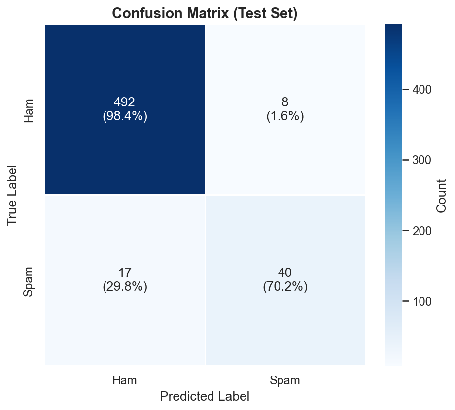

# Vietnamese Spam Classifier với PhoBERT

Dự án này ứng dụng mô hình ngôn ngữ [PhoBERT (v2)](https://huggingface.co/vinai/phobert-base-v2) của [VinAI](https://huggingface.co/vinai) để giải quyết bài toán phân loại tin nhắn/email tiếng Việt thành 2 nhãn: **Spam** (Thư rác/Lừa đảo) và **Ham** (Thư thường) dựa trên bộ dữ liệu [Vietnamese Spam Post in Social Network](https://www.kaggle.com/datasets/victorhoward2/vietnamese-spam-post-in-social-network). 

Bằng cách tinh chỉnh toàn bộ tham số (Full Fine-tuning) kết hợp với các kỹ thuật tiền xử lý văn bản chuyên biệt cho tiếng Việt (giữ lại cấu trúc URL để tăng độ nhạy bắt link lừa đảo), mô hình đạt độ chính xác (Precision) và khả năng tổng quát hóa cực kỳ cao trên dữ liệu thực tế.

---

## Kết quả Huấn luyện (Training Results)

Mô hình đã hội tụ rất tốt sau quá trình huấn luyện, đảm bảo khả năng bắt Spam chính xác mà không nhận diện nhầm thư quan trọng của người dùng.

### 1. Biểu đồ Huấn luyện (Cost & Metrics)
Theo dõi diễn biến Loss và các chỉ số (Accuracy, F1, Precision, Recall) qua 5 Epoch:



### 2. Ma trận Nhầm lẫn (Confusion Matrix)
Chi tiết khả năng phân loại trên tập dữ liệu kiểm thử (Test Set):



---

## Yêu cầu phần cứng
- **Hệ điều hành:** Windows / Linux / macOS
- **GPU:** Khuyến nghị sử dụng GPU có hỗ trợ NVIDIA CUDA để Training.
- **VRAM:** Đã được kiểm thử thực tế và hoạt động mượt mà trên card **NVIDIA RTX 4050 (Tiêu thụ khoảng 4.5GB / 6.0GB VRAM)** với Batch Size `24`.

---

## Cấu trúc Dự án

```text
.
├── dataset/
│   └── vi_dataset.csv    # Dữ liệu huấn luyện tiếng Việt
├── models/
│   ├── phobert_v2/             # Thư mục chứa Pre-trained Model (Tải về từ HuggingFace)
│   └── phobert_spam_final/     # Thư mục chứa Model sau khi train xong
├── out/
│   ├── checkpoints/             # Thư mục chứa các checkpoint trong quá trình train
│   └── visualization/          # Thư mục lưu ảnh biểu đồ
├── custom_utils.py             # Class Dataset, hàm Preprocessing & Evaluation
├── predict.py                  # Script sử dụng model để dự đoán (Inference)
├── train.py                    # Script huấn luyện model (Fine-tuning)
├── pyproject.toml              # Cấu hình môi trường UV & Dependencies
└── README.md                   # File tài liệu dự án
```

## Tải mô hình PhoBERT base v2

```bash
hf download vinai/phobert-base-v2 --local-dir ./models/phobert_v2
```

---

## Setup dependencies

```bash
uv sync
```